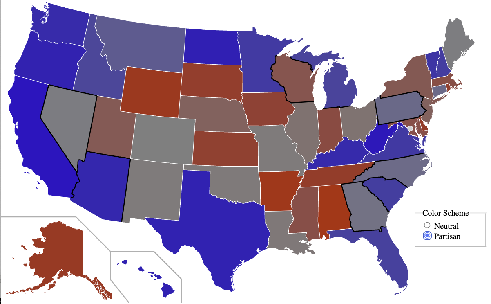
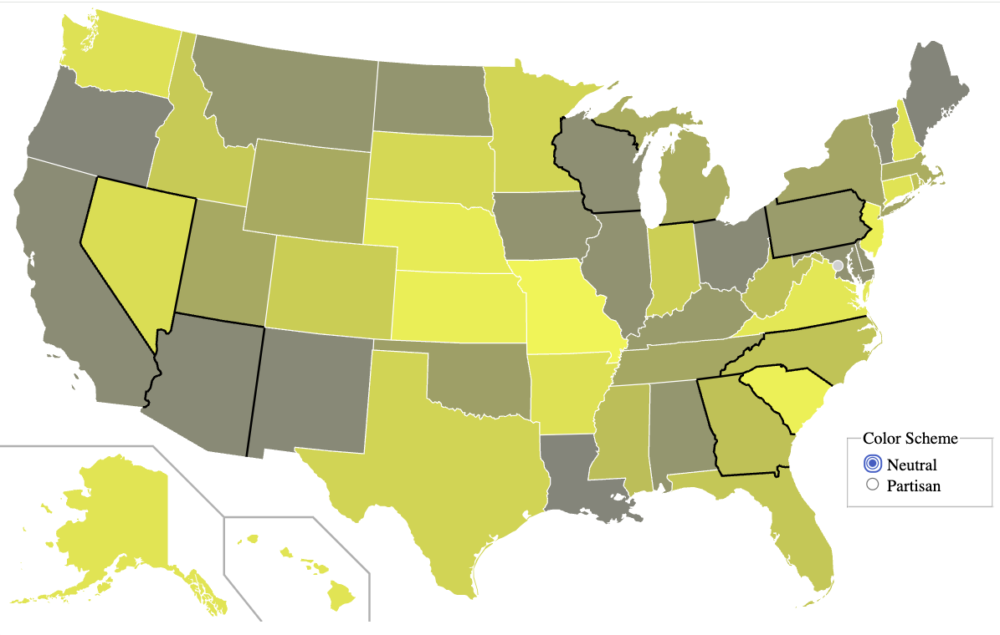

# US 2024 Election Map by State

## Purpose
This visualization is designed to hilight discrepancies between Senatorial and Presidential races, by state.

## Best Viewed

To view the interactive map see [smurp.github.io/US_Election_by_State](https://smurp.github.io/US_Election_by_State/).

<iframe src="./USA_2024.svg" width="100%" height="600px" style="border:none;" scrolling="no"></iframe>

## Color Schemes
The <i>swing states</i> are bordered in black.  You can toggle between a Neutral and a Partisan color scheme.

| Partisan                                | Neutral                                       |
|-----------------------------------------|-----------------------------------------------|
|            |                    |
| yellow - grey - yellow                  | red - grey - blue                             |
| Brighter the yellow, the more skew      | The more blue, or red, the more skew that way |
| Hide party but show skew                | Reveal party but skew harder to equate        |

## A Plea and a Warning
WARNING: the data is currently random! You can help by providing the data.
Ideally, with the url from which the data was obtained and by what means.  Even if you can't figure out
how to scrape it out of the source, perhaps I can help with that...

---

### Links
- [Original Hypothesis by Spoonamore](https://x.com/Spoonamore/status/1854912281865552027)
- [View the GitHub repository](https://github.com/smurp/US_Election_by_State/)
- [Map source on WikiMedia](https://commons.wikimedia.org/wiki/File:Blank_US_Map_(states_only).svg)

